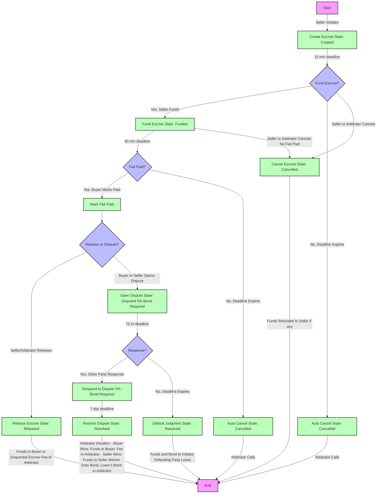

# LocalSolana Escrow Contract

## Overview
This is a Solana smart contract built using the Anchor framework, designed to facilitate secure escrow transactions between a buyer and a seller, with support for dispute resolution handled by a hardcoded arbitrator. The contract uses USDC (a token with 6 decimals) and includes features such as sequential trades, deadlines, fees, and a dispute bond mechanism.

The contract enforces a maximum transaction amount of 100 USDC, charges a 1% fee (paid to the arbitrator), and requires a 5% dispute bond from parties initiating or responding to disputes. It includes detailed state management and emits events for tracking transaction progress.

## Features
- **Escrow Creation**: Initialize an escrow with a seller, buyer, amount, and optional sequential trade address.
- **Funding**: Seller deposits USDC into the escrow within a 15-minute deadline.
- **Fiat Payment Confirmation**: Buyer marks fiat payment as completed within a 30-minute deadline after funding.
- **Release**: Funds are released to the buyer (or sequential escrow) after fiat payment confirmation.
- **Cancellation**: Escrow can be canceled by the seller or arbitrator if deadlines are missed or fiat isn't paid.
- **Dispute Resolution**:
  - Either party can open a dispute with a 5% bond and evidence hash.
  - The other party must respond within 72 hours with their own bond and evidence.
  - The arbitrator resolves disputes within 7 days or issues a default judgment if one party fails to respond.
- **Sequential Trades**: Supports chaining escrows for multi-step transactions.
- **Automatic Cancellation**: The arbitrator can cancel escrows that miss deadlines.

## Constants
- **Maximum Amount**: 100 USDC (`100_000_000` in 6-decimal format)
- **Fee**: 1% of the transaction amount (`100 basis points`)
- **Dispute Bond**: 5% of the transaction amount (`500 basis points`)
- **Deadlines**:
  - Deposit: 15 minutes from escrow creation
  - Fiat Payment: 30 minutes after funding
  - Dispute Response: 72 hours after dispute initiation
  - Arbitration: 7 days after dispute response
- **Arbitrator**: Hardcoded public key (`GGrXhNVxUZXaA2uMopsa5q23aPmoNvQF14uxqo8qENUr`)

For localnet testing, deadlines can be shortened to 1 minute each (commented out in the code).

## Program Structure

### Instructions
The contract defines the following public functions:

1. **`create_escrow`**
   - Initializes an escrow with seller, buyer, amount, and optional sequential address.
   - Validates amount and sets a deposit deadline.

2. **`fund_escrow`**
   - Seller transfers USDC (principal + fee) to the escrow token account.
   - Sets a fiat payment deadline.

3. **`mark_fiat_paid`**
   - Buyer confirms fiat payment before the fiat deadline.

4. **`update_sequential_address`**
   - Buyer updates the sequential escrow address for chained trades.

5. **`release_escrow`**
   - Seller or arbitrator releases funds to the buyer (or sequential escrow) after fiat payment.
   - Fee goes to the arbitrator.

6. **`cancel_escrow`**
   - Seller or arbitrator cancels the escrow if unfunded or fiat isn’t paid, refunding funds to the seller.

7. **`initialize_buyer_bond_account` / `initialize_seller_bond_account`**
   - Initializes bond accounts for dispute resolution.

8. **`open_dispute_with_bond`**
   - Buyer or seller opens a dispute with a 5% bond and evidence hash.

9. **`respond_to_dispute_with_bond`**
   - The other party responds with their own 5% bond and evidence hash within 72 hours.

10. **`default_judgment`**
    - Arbitrator awards funds and bond to the responding party if the other fails to respond after 72 hours.

11. **`resolve_dispute_with_explanation`**
    - Arbitrator resolves the dispute, awarding funds to either buyer or seller based on evidence.
    - Winner gets their bond back; loser’s bond goes to the arbitrator.

12. **`auto_cancel`**
    - Arbitrator cancels escrows that miss deposit or fiat deadlines, refunding funds if present.

### Accounts
- **`Escrow`**: State account storing escrow details (IDs, parties, amount, deadlines, state, etc.).
- **`escrow_token_account`**: Token account holding the escrowed USDC.
- **`buyer_bond_account` / `seller_bond_account`**: Token accounts for dispute bonds.

### State Machine
- `Created`: Escrow initialized, awaiting funding.
- `Funded`: Funds deposited, awaiting fiat payment confirmation.
- `Released`: Funds released to buyer or sequential escrow.
- `Cancelled`: Escrow terminated, funds refunded to seller if deposited.
- `Disputed`: Dispute opened, awaiting response or resolution.
- `Resolved`: Dispute concluded by arbitrator.

### Error Codes
Custom errors (`EscrowError`) handle invalid inputs, unauthorized actions, deadline expirations, and more.

### Events
Events are emitted for key actions (e.g., `EscrowCreated`, `FundsDeposited`, `DisputeOpened`) with relevant data for off-chain tracking.

## Dependencies
- **Anchor**: Framework for Solana smart contracts.
- **anchor_lang**: Core Anchor library.
- **anchor_spl**: Integration with Solana Program Library (SPL) for token operations.

## Usage

### Prerequisites
- Solana CLI and Rust installed.
- Anchor CLI for building and deploying.
- A USDC mint and token accounts for seller, buyer, and arbitrator.

### Deployment
1. Update the `declare_id!` with your program ID.
2. Build with `anchor build`.
3. Deploy with `anchor deploy`.

### Testing
- Use the commented shorter deadlines for localnet testing.
- Test scripts should simulate seller funding, buyer fiat confirmation, and dispute scenarios.

### Example Flow
1. Seller creates escrow with 50 USDC (`create_escrow`).
2. Seller funds escrow within 15 minutes (`fund_escrow`).
3. Buyer marks fiat paid within 30 minutes (`mark_fiat_paid`).
4. Seller releases funds to buyer (`release_escrow`).
   - Buyer receives 49.5 USDC; arbitrator gets 0.5 USDC fee.

#### Dispute Flow
1. Buyer opens dispute with a 2.5 USDC bond (`open_dispute_with_bond`).
2. Seller responds within 72 hours with a 2.5 USDC bond (`respond_to_dispute_with_bond`).
3. Arbitrator resolves within 7 days (`resolve_dispute_with_explanation`).
   - Winner gets funds + their bond; loser’s bond goes to arbitrator.

#### Flow Chart

#### Explanation of the Flowchart

1. **Start**: The process begins with the seller initiating the escrow.
2. **Create Escrow**: The escrow is created in the `Created` state with a 15-minute deposit deadline.
3. **Fund Escrow Decision**:
   - If the seller funds within 15 minutes, it moves to `Funded`.
   - If the deadline expires, the arbitrator can auto-cancel it (`Cancelled`).
4. **Fiat Paid Decision**:
   - If the buyer marks fiat paid within 30 minutes, it proceeds.
   - If the deadline expires without fiat payment, it can be auto-cancelled (`Cancelled`).
5. **Release or Dispute**:
   - Seller or arbitrator can release funds (`Released`), ending the process.
   - Either party can open a dispute (`Disputed`), requiring a 5% bond.
6. **Dispute Path**:
   - If a dispute is opened, the other party has 72 hours to respond with their own bond.
   - No response leads to a `Default Judgment` (`Resolved`), favoring the initiator.
   - A response leads to arbitration, where the arbitrator resolves (`Resolved`) within 7 days.
7. **Cancellation**: Can occur at multiple points (unfunded, no fiat paid) by the seller or arbitrator.
8. **End**: The process concludes with funds distributed and the escrow in a terminal state (`Released`, `Cancelled`, or `Resolved`).

##### Notes
- **Sequential Trades**: The flowchart assumes a single escrow for simplicity. Sequential trades would extend the "Release Escrow" path to another escrow instance, which could be represented by looping back to "Create Escrow" with a new address.
- **Deadlines**: Time constraints (15 min, 30 min, 72 hr, 7 days) are noted on transitions.
- **Styling**: Custom Mermaid classes are added for visual distinction (terminal nodes, decisions, processes).

## Security Considerations
- **Hardcoded Arbitrator**: Centralizes trust; consider a multi-arbitrator system for production.
- **Deadlines**: Enforced on-chain but rely on accurate clock time.
- **Sequential Trades**: Requires careful validation of downstream escrows.
- **Bond Management**: Ensures disputes are serious but increases transaction costs.

## About

This is based on the YapBay Sequential Escrow System. https://YapBay.com

## More Information

Visit the primary LocalSolana repo for more information: [https://github.com/Panmoni/localsolana](https://github.com/Panmoni/localsolana).

## License
This contract is provided as-is, under the MIT license. Use and modify at your own risk.
